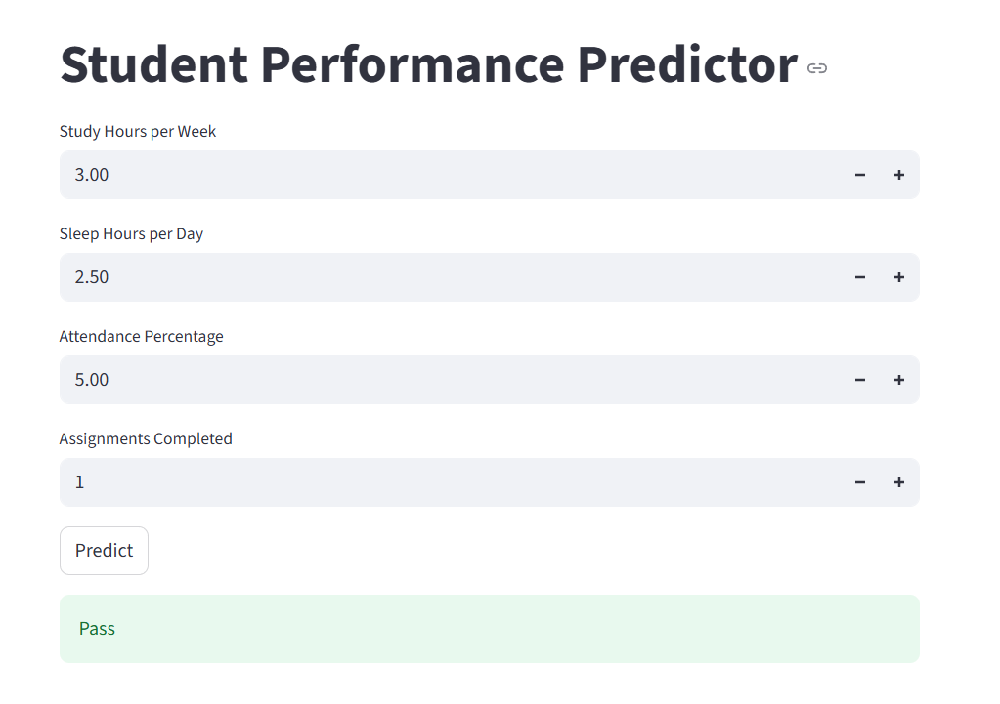

📝 Student Study Habits – Pass/Fail Prediction
📌 Project Overview

This project predicts whether a student will pass or fail based on their study habits and background attributes.

It applies machine learning classification techniques to explore the relationship between student behavior and academic performance.

📊 Dataset

📂 Source: Student Study Habits Dataset – Kaggle

Each row represents one student.

Features:

📖 Study Hours per Week (study_hours)

🎓 Attendance Rate (%) (attendance_rate)

📝 Assignments Completed (assignments_completed)

🛌 Sleep Hours (sleep_hours)

👪 Parental Education (parental_education)

Target Variable:

pass_fail → (Pass = 1, Fail = 0)

🎯 Problem Statement

A school wants to predict whether a student will pass or fail based on their study habits and background factors.

This is a binary classification problem.

🚀 How to Run

Clone or download this repository.

Open the Jupyter Notebook:

jupyter notebook task.ipynb

Run all cells step by step.

The notebook will:

Load and preprocess the dataset

Perform Exploratory Data Analysis (EDA)

Train Random Forest and Naïve Bayes classifiers

Compare their performance

Predict outcomes for new students

📈 Results & Model Comparison
Model	       Accuracy	    Notes
Naïve Bayes	    ~0.68	    Works for simple cases, less accurate
Random Forest	~0.90	    ✅ Best accuracy, robust and reliable

👉 Random Forest outperformed Naïve Bayes in terms of accuracy and reliability.

🎯 Expected Output

📊 Data insights (visualizations & statistics)

📌 Model performance metrics (accuracy, precision, recall, F1-score)

🤖 Prediction for a new student
My streamlit:

Example Input:

study_hours = 15
attendance_rate = 90%
assignments_completed = 10
sleep_hours = 8
parental_education = Bachelor's Degree

Example Output:
➡️ Random Forest → Pass ✅

✨ Conclusion

Both models were tested for predicting student performance.

Random Forest proved to be the most effective model for predicting pass/fail outcomes.